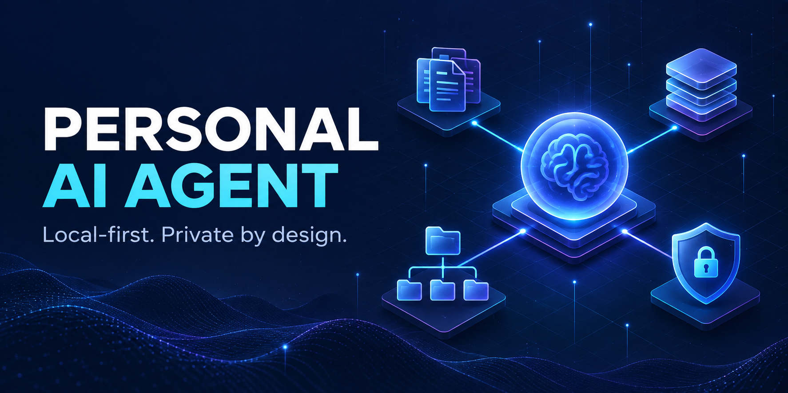
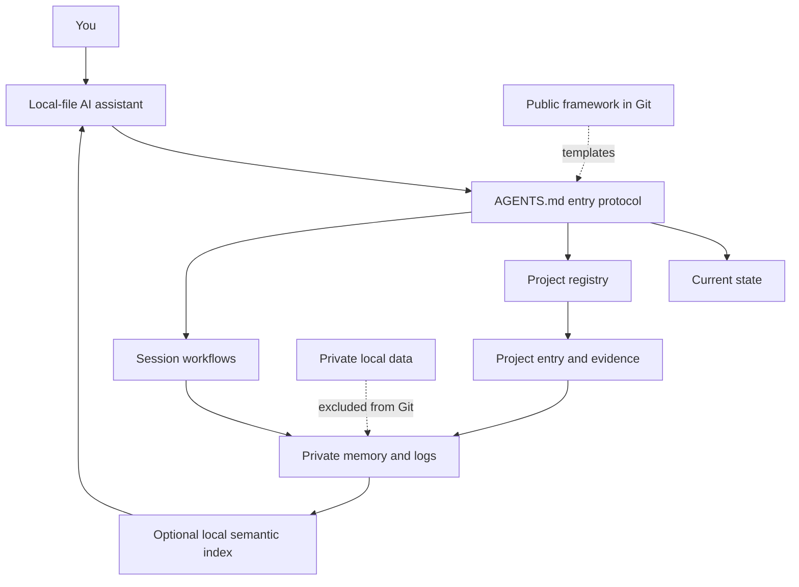

# Personal AI Agent

[简体中文](README.zh-CN.md)



**A local-first, file-based framework for an AI assistant that can remember, switch contexts, and continue across sessions without publishing your private life.**

Most AI chats forget the structure around your work. Personal AI Agent gives any local-file-capable assistant a small operating system: one entry protocol, durable memory, optional local semantic recall, project routing, session handoffs, privacy boundaries, and multi-device rules.

> The repository contains the reusable framework. Your profile, projects, conversations, knowledge base, credentials, and device paths are created locally and ignored by Git.

## Why this exists

Long-running AI work usually breaks in predictable ways:

- context is trapped in one chat window;
- different assistants maintain conflicting copies of the truth;
- absolute paths break when a workspace moves to another computer;
- notes, facts, decisions, and raw conversations become mixed together;
- personal data is accidentally committed with the code.

This project makes those boundaries explicit and inspectable.

## What you get

- **One entry point** — every assistant starts from `AGENTS.md` and the current-state file.
- **Layered memory** — current state, session history, and stable long-term decisions have different homes.
- **Optional semantic recall** — a local embedding index finds relevant history while the underlying files remain authoritative.
- **Project routing** — a registry sends each request to the right project entry and evidence.
- **Session continuity** — start/end workflows preserve the stopping point without treating chat history as the database.
- **Local-first privacy** — runtime data and device secrets are excluded from Git by default.
- **Portable paths** — shared files use relative paths; each device keeps its own local settings.
- **Auditable changes** — decisions, work logs, and raw conversation exports are stored separately.
- **Vendor-neutral design** — the protocol is plain Markdown and JSON, so it works with any assistant that can read local files.

## Architecture



## Five-minute start

Requirements: Python 3.9+ and an AI tool that can read files in a local folder.

```bash
git clone https://github.com/davidme6/personal-ai-agent.git
cd personal-ai-agent
python tools/init_workspace.py
python tools/check_workspace.py
```

Then open this folder in your AI tool and say:

> Read `AGENTS.md`, then read `.personal/current-state.md`. Tell me what you found before continuing.

The initializer creates only missing files. It will not overwrite an existing profile, state, or registry.

### Optional local semantic recall

Install the optional dependency, build a local index of `.personal/`, and query it:

```bash
python -m pip install -r requirements-memory.txt
python tools/memory_index.py
python tools/memory_recall.py "What did we decide about the launch?"
```

The first run may download the embedding model. The scripts process your content locally and store the rebuildable SQLite index in Git-ignored `.local/`. The database includes private text excerpts, so do not publish or sync it without appropriate encryption. See [Local semantic memory](docs/semantic-memory.md).

## Public framework vs. private workspace

| Public and versioned | Local/private by default |
|---|---|
| `AGENTS.md`, `config/`, `workflows/` | `.personal/profile.md` |
| templates and validation tools | `.personal/current-state.md` |
| documentation and community files | `.personal/projects/`, knowledge, logs |
| example registry schema | `.device/`, credentials, absolute paths |
| semantic-memory tools | `.local/memory_index.db` cache |

This separation is the core design. A private GitHub repository is still a repository upload; sensitive material should not enter Git history in the first place.

## Daily use

1. The assistant reads the entry protocol and current state.
2. It finds the active project through `.personal/project-registry.json`.
3. For history-dependent questions, it can recall likely sources from the optional local semantic index and then verify the source files.
4. It records work in the correct project/log location.
5. At the end, it updates the current state and creates a dated handoff.

See [the architecture](docs/architecture.md), [privacy model](config/privacy.md), and [multi-device guide](docs/multi-device.md).

## Design principles

- Files are the durable source of truth; a chat window is a temporary interface.
- Current state has one owner and one authoritative file.
- Raw material, verified knowledge, decisions, and task state are different data types.
- Old material remains searchable; age alone does not make it invalid.
- Sync makes files available elsewhere. A separate backup makes them recoverable.
- No framework rule authorizes an external upload, message, purchase, or destructive action.

## Repository layout

```text
personal-ai-agent/
├── AGENTS.md                 # agent entry protocol
├── config/                   # reusable architecture and privacy rules
├── workflows/                # session start/end procedures
├── templates/                # private workspace starters
├── tools/                    # initializer and validator
├── tests/                    # behavior tests
├── docs/                     # architecture, devices, FAQ
├── .personal/                # generated private data (Git-ignored)
├── .device/                  # generated machine-local data (Git-ignored)
└── .local/                   # optional semantic index cache (Git-ignored)
```

## Project status

The file protocol, safety boundaries, and optional local semantic-memory workflow are usable. Integrations with specific AI products remain intentionally thin so the framework stays portable.

## Roadmap

- More project templates and migration examples
- Optional encrypted backup recipes
- Import/export adapters for additional local AI tools
- Schema validation for larger project registries
- More end-to-end continuity tests

## Contributing

Issues and pull requests are welcome. Start with [CONTRIBUTING.md](CONTRIBUTING.md). Please report security concerns through [SECURITY.md](SECURITY.md) and never include real personal data or credentials in an issue.

## License

[GNU Affero General Public License v3.0 only](LICENSE) © 2026 davidme6. Commercial use is allowed under the AGPL; modified versions offered to users over a network must also offer their corresponding source. Organizations that need proprietary use without the AGPL source-sharing obligations can review [commercial licensing](COMMERCIAL-LICENSE.md).

## Support the project

If this framework saves you time, you can support its maintenance below. Support is voluntary and does not change access, support priority, or licensing.

<table>
  <tr>
    <th>PayPal</th>
    <th>Alipay / 支付宝</th>
  </tr>
  <tr>
    <td align="center"><a href="https://www.paypal.com/qrcodes/p2pqrc/CQYXPCYKSA6NC"></a><br /><code>shengyichaogg@gmail.com</code></td>
    <td align="center"><a href="docs/assets/alipay-support.jpg"></a></td>
  </tr>
</table>

Please verify the recipient before paying. See [SUPPORT.md](SUPPORT.md) for details and other ways to help.

Related project: [AI Learning Method](https://github.com/davidme6/ai-learning-method).
