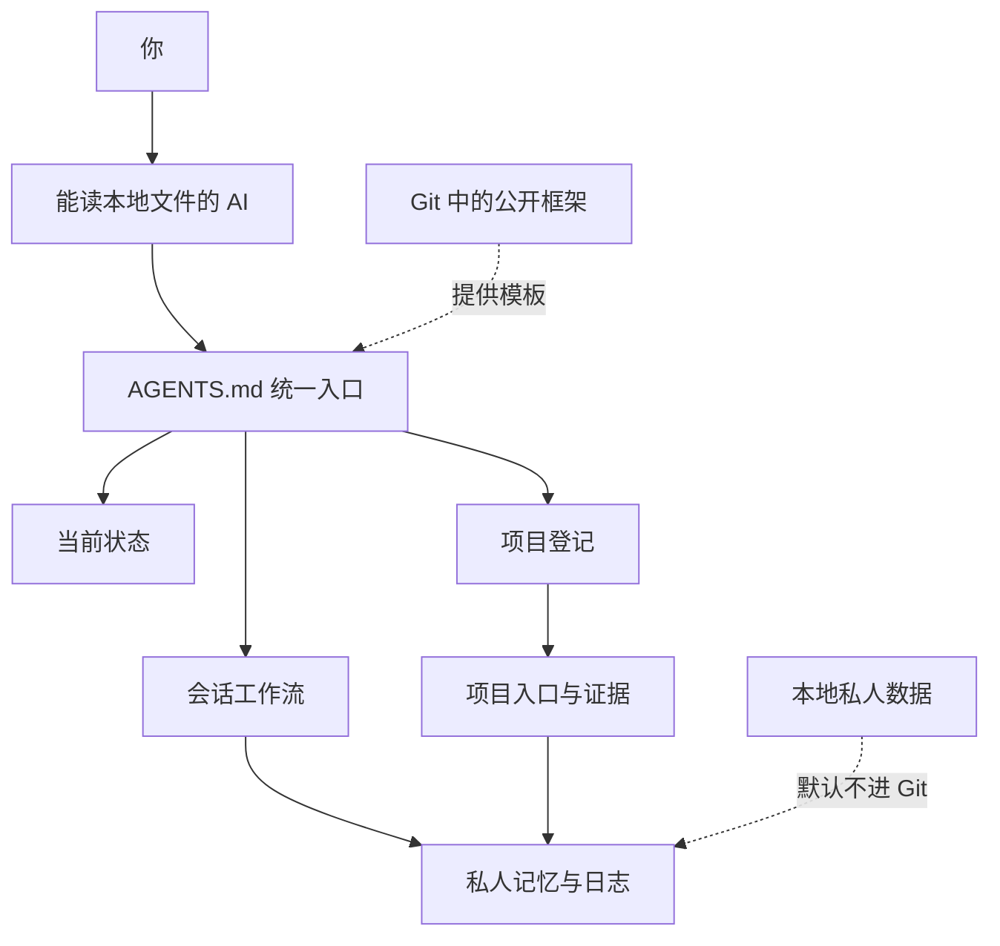

# Personal AI Agent｜个人数字分身

[English](README.md)


**一套本地优先、以文件为长期记忆的个人 AI Agent 架构：能跨会话接着做、能切换项目，也能把你的私人资料留在公开仓库之外。**

很多 AI 对话的问题不是模型不够强，而是工作上下文被困在窗口里：新会话忘记进度，多台设备路径不一致，不同 Agent 各写一套状态，代码与个人资料又容易混到一起。

这个项目提供一套小而完整的“运行协议”：统一入口、分层记忆、项目路由、会话交接、隐私边界和多设备规则。

> 公开仓库只包含可复用架构。你的个人画像、项目资料、聊天、知识库、凭据和本机路径由初始化工具在本地生成，并默认排除在 Git 之外。

## 它解决什么

- 新窗口不知道上次做到哪里；
- 多个 Agent 对“当前状态”理解不一致；
- 台式机、笔记本的绝对路径不同；
- 原始资料、已验证知识、决策和聊天混在一起；
- 代码开源时误带个人记忆或业务文件。

## 核心能力

- **统一入口**：每个 Agent 先读 `AGENTS.md` 和当前状态。
- **分层记忆**：当前状态、会话历史、稳定长期决定分开保存。
- **项目路由**：通过登记表找到正确项目入口和证据。
- **跨窗口连续**：用启动/结束工作流保留精确停点。
- **本地隐私**：个人数据、本机信息和密钥默认不进 Git。
- **异机路径**：公共文件只写相对路径，每台设备单独保存本机配置。
- **工作留痕**：原始对话、工作日志、任务状态、决策摘要各归其位。
- **不绑定模型**：核心是 Markdown 和 JSON，任何能读本地文件的 Agent 都能采用。

## 架构



## 五分钟开始

需要 Python 3.9+，以及一个能读取本地目录的 AI 工具。

```bash
git clone https://github.com/davidme6/personal-ai-agent.git
cd personal-ai-agent
python tools/init_workspace.py
python tools/check_workspace.py
```

然后让 AI 打开这个目录并说：

> 先读 `AGENTS.md`，再读 `.personal/current-state.md`，告诉我你读到的当前状态，再继续工作。

初始化工具只创建缺失文件，不覆盖已经存在的个人画像、状态或项目登记。

## 公开框架和私人工作区

| 公开、可版本管理 | 默认只在本地 |
|---|---|
| `AGENTS.md`、`config/`、`workflows/` | `.personal/profile.md` |
| 模板、检查工具、公开文档 | `.personal/current-state.md` |
| 示例登记结构 | `.personal/projects/`、知识、日志 |
| 社区与贡献文件 | `.device/`、密钥、本机绝对路径 |

这是整个项目最重要的边界。私有 GitHub 仓库也属于上传，敏感资料最好从一开始就不进入 Git 历史。

## 日常流程

1. Agent 读取统一入口和当前状态。
2. 通过 `.personal/project-registry.json` 找到当前项目。
3. 只读取本任务需要的材料。
4. 把产物和记录写入对应位置。
5. 收尾时更新当前状态并生成带日期的交接。

详细说明见[架构](docs/architecture.md)、[隐私模型](config/privacy.md)和[多设备指南](docs/multi-device.md)。

## 设计原则

- 文件是长期事实来源，对话窗口只是临时界面。
- 全局当前状态只有一个权威文件。
- 原始资料、核验知识、决策和任务状态分类保存。
- 旧资料仍可检索，不能仅凭时间判断失效。
- 同步解决“另一台设备能看见”，独立备份解决“损坏后能恢复”。
- 框架规则不会自动授权上传、外发、购买或破坏性操作。

## 目录

```text
personal-ai-agent/
├── AGENTS.md                 # Agent 统一入口
├── config/                   # 通用架构与隐私规则
├── workflows/                # 会话启动和结束
├── templates/                # 私人工作区模板
├── tools/                    # 初始化和检查工具
├── tests/                    # 行为测试
├── docs/                     # 架构、设备与常见问题
├── .personal/                # 初始化后生成，Git忽略
└── .device/                  # 每台设备独立生成，Git忽略
```

## 当前阶段与路线图

这是第一版公开模板，文件协议和安全边界已经可用。后续计划增加更多项目模板、加密备份示例、不同本地 AI 工具的接入方式、登记表校验和连续性端到端测试。

## 参与贡献

欢迎提交 Issue 和 Pull Request。先读 [CONTRIBUTING.md](CONTRIBUTING.md)。安全问题按 [SECURITY.md](SECURITY.md) 处理，不要在 Issue 中放真实个人资料或密钥。

## 许可证

[GNU Affero General Public License v3.0 only](LICENSE) © 2026 davidme6。AGPL 允许商业使用，但通过网络向用户提供修改版时，也要向这些用户提供对应源码。需要闭源集成且不承担 AGPL 源码开放义务的组织，可查看[商业授权说明](COMMERCIAL-LICENSE.md)。

## 支持项目

如果这个框架帮你节省了时间，可在 [SUPPORT.md](SUPPORT.md) 中自愿支持维护。支持与否不影响功能、支持优先级或开源授权。

相关项目：[AI Learning Method](https://github.com/davidme6/ai-learning-method)。
